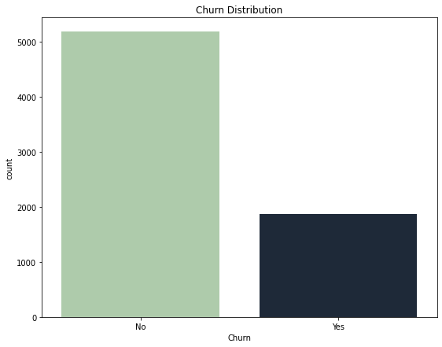
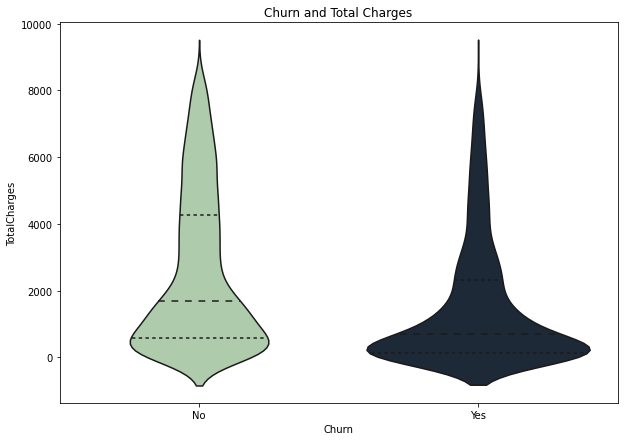
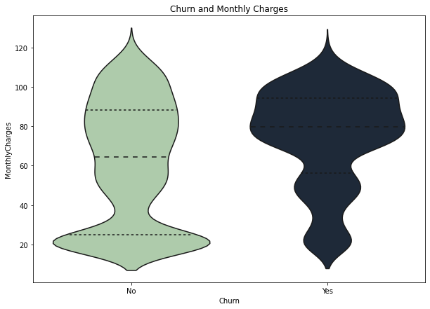
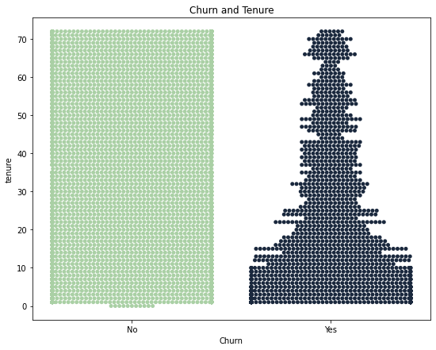

<h1 align="center">Customer Churn Behavior Analysis</h1>

Customer churn is one of the user behaviors that need to be tracked. A high churn rate is an indication if something needs to be improved on the product. It can be related to many things, for example, an error in the customer journey, product pricing, or customer preferences. Maintaining customer costs less than gaining the new one is another reason why tracking customer churn becomes beneficial. It can also reveal consumer acceptance of our products.

## ✨Data

Dataset contains data about telco consumers' indications to churn. Telco is a fictional company that provided home phone and internet services. It consist of 21 columns and 7043 rows. Each row represents unique customer information such as:

1. Customers who leave within the last month (churn)
2. Demographic Info (gender, senior citizen, partner, dependents)
3. Service Plan (phone service, multiple lines, internet, online security, online backup, device protection, tech support, streaming TV, and streaming movies)
4. Customer account information (contract term of customer, payment method, paperless billing, tenure (number of months the customer has stayed with the company), monthly charges, total charges)

Dataset downloaded from [Kaggle](https://www.kaggle.com/blastchar/telco-customer-churn), but also accesible [here](https://github.com/afidas/churn-behavior/blob/main/Telco%20Churn.csv).

## ✨Consumers Churn Behavior

Based on data, 30% of users are churning. Churn associated with the loyalty of users. Loyalty refers to the length of time subscription and the number of product purchases. In the dataset, it define by tenure variable and service plan subscription. 

  

## ✨Exploratory Data Analysis

EDA starts from analyzing Churn on numerical variables. These are total charges, monthly charges, and tenure. It can be concluded that total charges are the multiplication of tenure and monthly charges.

  

  

  

Churn behavior is detected on users who have low tenure values and high monthly charges. Meanwhile, the total charges for churn and non-churn users remain the same.

## ✨Business Problem

Based on numerical variable analysis, it can be summed up that churn users are new users who spend more money. This result explained why Total Charges has the same value over churn and non-churn users. But, it raises a new question of **why new users have higher monthly charges? Is there something wrong with the product we are selling?.** This question will be answered by analyzing service plan by churn.

  

## ✨ Service Plan Analysis

Based on the analysis of the service plan, the following data were obtained:

| Service Plan | Yes | No |
| --- | --- | --- |
| Phone Service | No churn | No Churn |
| Multiple Lines | Churn | No Churn  |
| Internet Service | Churn | No Churn  |
| Online Security | No churn | Churn |
| Online Backup | No churn | Churn |
| Device Protection | No Churn | Churn |
| Tech Support | No Churn | Churn  |

Based on the table above, phone service gets the most positive response. Meanwhile, consumers will react negatively and churn when they subscribe to multiple lines. On the other side, Internet services get different reactions since majority of consumers who use are churning. In the other service plan, churning users are those who don't subscribe.

The above analysis does not provide an in-depth picture of user behavior. We suspect that users may be more loyal to the product if they do multiple subscriptions to the internet service. Consumers will subscribe to multiple subscriptions if they subscribe to internet service with other additional services such as online security, online backup, device protection, and tech support. This hypothesis will be evaluate using a hypothesis testing called chi-square analysis.

## ✨Hypothesis Testing

To prove the statement that users who perform multiple service subscriptions have a lower probability of churn, hypothesis testing is carried out using chi-square.

    H0 = There is no relationship between doing multiple service plan subscriptions with a low tendency to churn

    H1 = There is a relationship between doing multiple service plan subscriptions with a low tendency to churn

## ✨Effect Size

Effect size between multiple service subscriptions and churn will be calculated using the following formula

    🔷 odds ratio: odss multiple subscription / odss single subscription

  **odds ratio of multiple subscription**= 3.09 / 2.36 = 1.3

  **odds ratio of single subscription**= 2.36 / 3.09 = 0.76

## ✨Solution

Based on the analysis, the chi-square value is greater than the critical value, and the p-value is smaller than alpha **(χ2 (1) = 338,965, p < .000)**. 
It makes **H0 is rejected** and proves the relationship between multiple subscriptions and churn. Based on the odds ratio, the odds of churn were 1.3 higher 
if consumers do multiple subscriptions. 
Meanwhile, the odds ratio of churn was 0.76 higher if consumers do a single subscription. It makes multiple subscriptions doesn't prevent consumers from churning. 
However, it explains the data that has been obtained previously if consumers with high monthly charges tend to churning.

## ✨Conclusion

This analysis is divided into two stages:

1. [Exploratory data analysis 📁](https://github.com/afidas/churn-behavior/blob/main/Churn_EDA.ipynb)
2. [Hypothesis testing using chi-square📁](https://github.com/afidas/churn-behavior/blob/main/Hypothesis_testing.ipynb)

The analysis above explains if the internet and other additional products need to be improved to satisfy consumers and prevent them from churning. 
It also applies to multiple lines services. Meanwhile, phone service already has good performance.

## ✨Reference

1. Field, A. P., Miles, J., & Field, Z. (2012). *Discovering statistics using R*. Page 820 - 828
2. [Hypothesis Testing in Machine Learning using Python](https://towardsdatascience.com/hypothesis-testing-in-machine-learning-using-python-a0dc89e169ce)
